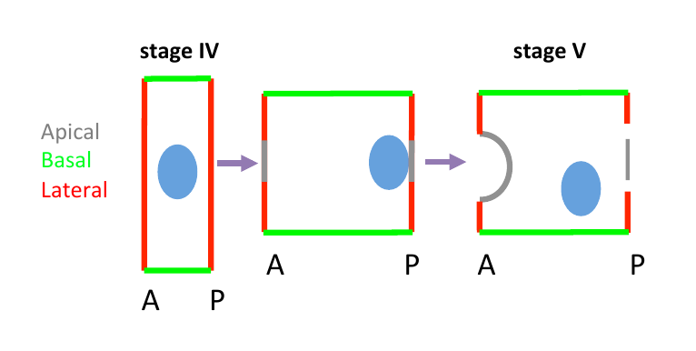

# Analysis methods used in quantifying effectors of the _Ciona intestinalis_ notochord development

In Hoyer et al we imaged calcium dynamics in the developing notochord of Ciona intestinalis. One of the aims of this project was to understand the interplay between calcium signalling and the molecular machinery (cellular effectors) mediating changes in cell behaviour. 

Effector molecules such as actin and microtubules are largely responsible for the changes in cell shape and movement that underlie out these changes in notochord cell behaviour (intercalation, elongation, MET). In Hoyer et al we wanted to quantify how much the calcium drugs affected the distribution of these effector molecules relative to controls. For this we looked at the fractal dimension of the cytoskeleton. The code for that analysis can be found [in its own repository](https://github.com/ChatzigeorgiouGroup/FractalDimension).

During notochord formation, adhesion junctions between neighbouring notochord cells are remodelled. This remodelling takes place throughout lumen enlargement and luminal domain expansion. A well-established marker of adhesion junctions is E-cadherin. Work from Di Jiang’s lab has shown that in wild type animals E-cadherin is localized at the lateral membrane domains, where notochord cells are contacting each other during stage IV. Very little or no expression of E-cadherin has been reported on the basal domain of the notochord cells.  We wanted to quantify the distribution of E-cadherin following our pharmacological treatments. 

To explore the code for this analysis, launch this repository in 

  

